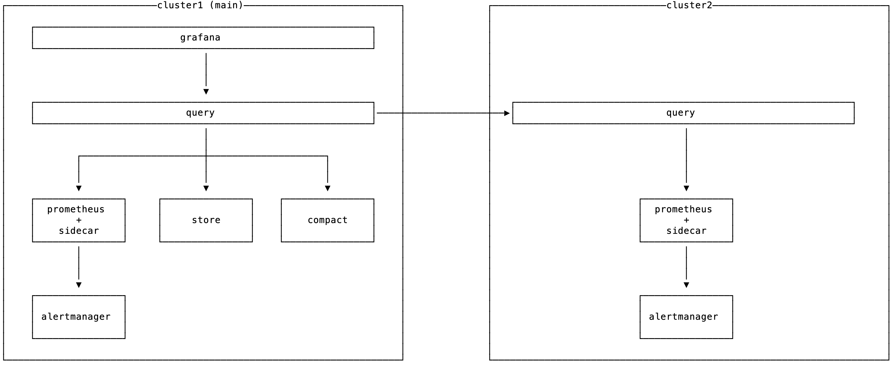

# thanos helm chart

Helm chart that install and configure prometheus-operator and thanos.

## Goal

Make it as easy and reproducible as possible to setup a high-available and
durable prometheus on kubernetes using prometheus-operator and thanos.

## Getting started

#### 0. Helm repository

```sh
helm repo add carlos https://carlos-charts.storage.googleapis.com
helm repo update
```

#### 1. Namespace

```sh
kubectl create namespace thanos
```

#### 2. Storage config

You'll need a thanos storage config yaml file, as per
[documentation](https://thanos.io/storage.md/).

Then craete a `thanos-storage-config.yaml` file based on the provided
`thanos-storage-config.yaml.example`.

#### 3. Values file

Create a `values.yaml` file based on the provided `values.yaml.example`.
You can check all option available at `./thanos/values.yaml`, as well as
on the official `prometheus-operator` and `grafana` Helm charts.

#### 4. Install/Upgrade

```sh
helm upgrade --install --namespace thanos thanos carlos/thanos \
  -f values.yaml \
  --set-file objectStore=thanos-storage-config.yaml
```

#### 5. Port-forward services

You can then port-forward the services you want:

```sh
kubectl -n thanos port-forward svc/thanos-query-http 8080:10902
kubectl -n thanos port-forward svc/thanos-prometheus-operator-prometheus 9090:9090
kubectl -n thanos port-forward svc/thanos-grafana 3000:80
# etc...
```

---

## Multi-cluster architecture

On a multi-cluster (global) architecture the idea is to deploy the "full thing""
on a "central cluster", and only prometheus, alertmanager (?), thanos sidecar
and thanos query on all others:



If you want to play with it locally without having 2 "real clusters" to mess
with, you can follow this steps to deploy 2 workloads on 2 different
namespaces: `thanos1` and `thanos2`.

I recommend using `k3s` as it uses less resources and its fast to set up
with `k3d`.

```sh
# create a cluster with k3d
k3d create -n multiple-thanos --wait 0

# fix kubeconfig
export KUBECONFIG="$(k3d get-kubeconfig --name='multiple-thanos')"

# setup helm/tiller
kubectl create serviceaccount --namespace kube-system tiller
kubectl create clusterrolebinding tiller-cluster-admin --clusterrole=cluster-admin --serviceaccount=kube-system:tiller
helm init --service-account tiller --upgrade --wait

# install thanos1
helm upgrade --install --namespace thanos1 thanos1 ./thanos \
	--wait \
	--timeout 600 \
	-f examples/values1.yaml \
	--set-file objectStore=thanos-storage-config.yaml

# install thanos2
helm upgrade --install --namespace thanos2 thanos2 ./thanos \
	--wait \
	--timeout 600 \
	-f examples/values2.yaml \
	--set-file objectStore=thanos-storage-config.yaml
```

Finally, verify you `thanos1` query services can see both `thanos1` store and
sidecar as well as `thanos2` query:

```sh
kubectl -n thanos1 port-forward svc/thanos1-query-http 8080:10902

open http://localhost:8080
```

You should see 3 categories:

- query (from `thanos2`)
- sidecar (from `thanos1`)
- store (from `thanos1`)

So you could have `thanos3`, `thanos4`, `thanosN` and service discover all of
them on `thanos1` query.

On "a real world deployment" you'll have an ingress in front of each query
on each cluster, and `thanos1` query would talk directly to the load balancer.

---

## Grafana data stored in an external database (mysql)

Useful if you want to make sure you won't loose your grafana dashboards and stuff.

```sh
# create a cluster with k3d
k3d create -n grafana-thanos --wait 0

# fix kubeconfig
export KUBECONFIG="$(k3d get-kubeconfig --name='grafana-thanos')"

# setup helm/tiller
kubectl create serviceaccount --namespace kube-system tiller
kubectl create clusterrolebinding tiller-cluster-admin --clusterrole=cluster-admin --serviceaccount=kube-system:tiller
helm init --service-account tiller --upgrade --wait
```

For the sake of simplicity in this particular case, we're going to deploy
the mysql helm chart to our cluster as well:

```sh
helm upgrade --install --namespace mysql grafanadb \
  --set mysqlUser=grafana \
  --set mysqlPassword=super-secret \
  --set mysqlDatabase=grafana \
  --set persistence.enabled=false \
  --wait \
  --timeout 600 \
  stable/mysql
```

And we need a secret for grafana to access the password:

```sh
# first create the namespace if its not there already
kubectl create ns thanos

# then create the secret
kubectl -n thanos apply -f ./examples/grafana-secrets.yaml
```

Finally install thanos:

```sh
helm upgrade --install --namespace thanos thanos ./thanos \
	--wait \
	--timeout 600 \
	-f examples/values3.yaml \
	--set-file objectStore=thanos-storage-config.yaml
```

---

## TODO

- [x] remove peering options (deprecated on thanos 0.4.0+)
- [x] remove some not very useful options, leave sane defaults
- [x] servicemonitors for thanos components
- [x] figure out how to store grafana stuff on an external db
- [ ] TLS
  - [ ] improve config
- [x] service discovery inside the cluster
- [x] service discovery across clusters
- [x] dynamic prometheus replica label for deduplication - see [#2591](https://github.com/coreos/prometheus-operator/pull/2591)
- [x] recommended rules for thanos components
- [x] recommended dashboards for thanos components
- [x] thanos as datasource in grafana
- [x] objectstore config as file
- [x] ingresses?
- [x] repo/releases

---

## Useful resources

- https://itnext.io/monitoring-kubernetes-workloads-with-prometheus-and-thanos-4ddb394b32c
